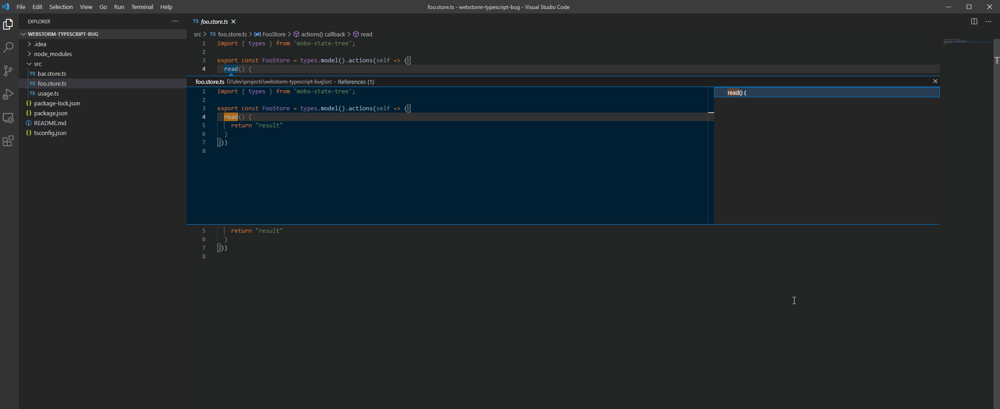
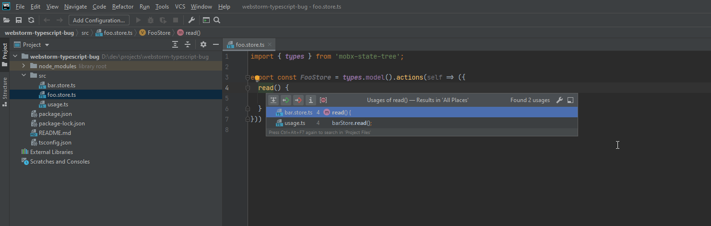

# WebStorm 2020.3 issue with invalid usages from MobX State Tree

Steps to reproduce:

1. Install deps

       npm ci

2. Open `./src/foo.store.ts`
3. Set cursor within `read()` and press `Alt + Ctrl + F7` (Find Usages)

Actual: shows invalid usage in `usage.ts` file
Expected: shouldn't find any usages (this store is not even imported anywhere)

##NOTICE

VSCode behaves as expected.

